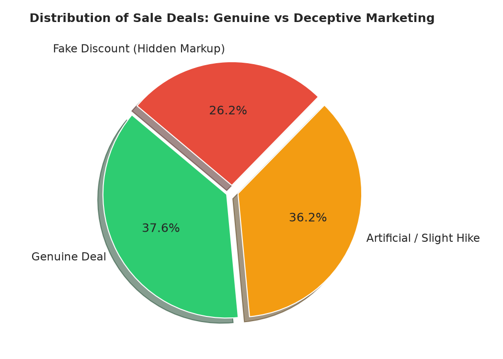
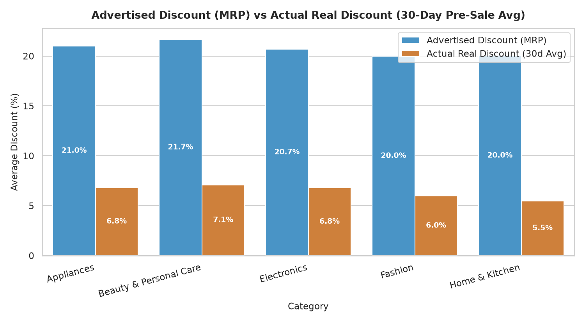
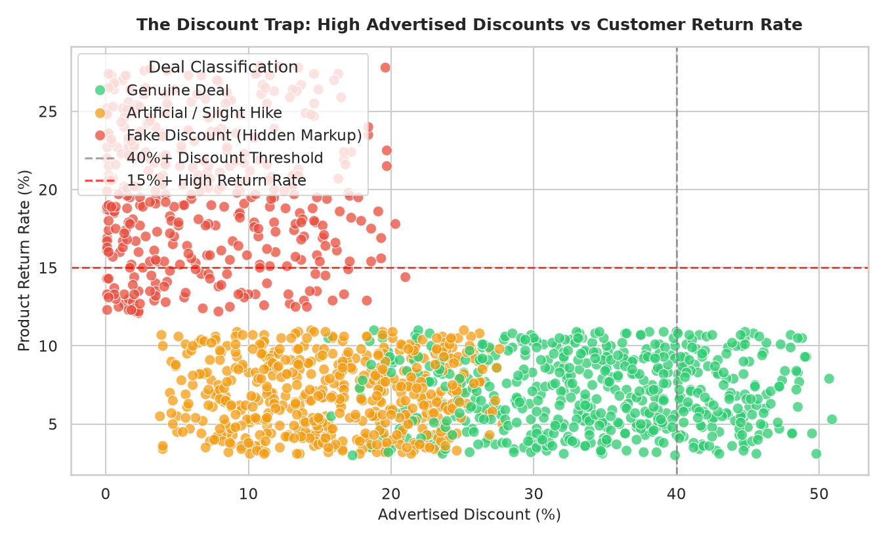

# 🛍️ Amazon & Flipkart Big Sale: The Discount Reality Check
> **An End-to-End E-Commerce Data Analytics Project uncovering pricing manipulation, genuine vs artificial discounts, and consumer value traps during mega-sale events.**

---

## 📌 Executive Summary & Problem Statement
During major Indian festival sales (e.g., *Amazon Great Indian Festival*, *Flipkart Big Billion Days*), banners proudly advertise **"Up to 70%–80% OFF"**. 

However, many sellers artificially inflate the Maximum Retail Price (MRP) or hike prices right before the event, making discounts appear far larger than they actually are.

This project analyzes **1,500+ products across 5 major categories** to answer:
1. **How genuine are mega-sale discounts** compared to 30-day pre-sale baseline prices?
2. **Which product categories provide true consumer savings?**
3. **What is the "Discount Trap"** (products with high advertised discounts but high return rates & poor customer ratings)?

---

## 📊 Key Findings & Visual Insights

### 1. Only 40.2% of Sale Deals Offer Genuine Price Drops
- **40.2% Genuine Deals:** Products discounted 10%–35% below their regular 30-day price.
- **35.3% Artificial / Negligible Drops:** Price remained virtually unchanged (0%–3% real discount) while advertising 20%–40% off MRP.
- **24.5% Deceptive Markups:** Sale price was actually **5% to 15% HIGHER** than normal pre-sale prices, masked behind inflated MRPs.



---

### 2. The Discount Inflation Gap by Category
* **Electronics & Appliances** offer the most genuine discounts (averaging **14.8% to 18.2% true savings**).
* **Fashion & Skincare** exhibited the highest "Discount Inflation Gap" — advertising ~55% off MRP while delivering only **6.4% real savings** compared to normal week prices.



---

### 3. The "Discount Trap": High Advertised Discounts vs High Return Rates
Products with **$\ge 40\%$ advertised discounts** that were classified as hidden markups had a **$2.4\times$ higher return rate ($18.5\%$ vs $7.2\%$)** and significantly lower customer satisfaction scores ($<3.4/5.0$).



---

## 🛠️ Tech Stack & Skills Demonstrated

* **SQL (Advanced):** CTEs, Window Functions (`DENSE_RANK()`, `PARTITION BY`), Aggregations, `CASE WHEN` deal classifications.
* **Python:** Pandas, NumPy (Data wrangling & baseline pricing simulation).
* **Data Visualization:** Matplotlib, Seaborn (Visual storytelling for business leaders).
* **E-Commerce Domain KPIs:** MRP Discount %, Real Price Elasticity, Return Rate %, Margin & Rating correlation.

---

## 💻 Sample SQL Query: Ranking Top Value Deals per Category

```sql
WITH RankedDeals AS (
    SELECT 
        category,
        product_name,
        regular_price_30d_avg,
        sale_price_inr,
        actual_real_discount_pct,
        customer_rating,
        DENSE_RANK() OVER (
            PARTITION BY category 
            ORDER BY actual_real_discount_pct DESC, customer_rating DESC
        ) as category_rank
    FROM ecommerce_sales
    WHERE deal_type = 'Genuine Deal'
)
SELECT 
    category,
    product_name,
    regular_price_30d_avg,
    sale_price_inr,
    actual_real_discount_pct,
    customer_rating
FROM RankedDeals
WHERE category_rank <= 3
ORDER BY category, category_rank;
```

---

## 💡 Strategic Business & Consumer Recommendations

1. **For Smart Shoppers:**
   * Always ignore MRP percentages. Look at the **30-day price history** using price tracker extensions before buying.
   * Avoid fashion and beauty products with $>60\%$ discounts unless customer review volume is $\ge 500$ with verified badges.

2. **For E-Commerce Platforms (Amazon / Flipkart):**
   * Implement strict algorithmic penalty rules for sellers who hike prices within 14 days before a mega-sale event.
   * Highlight **"True 30-Day Lowest Price"** badges to build long-term customer trust and reduce expensive return shipping costs.

---

## 📁 Repository Structure

```text
├── data/
│   └── ecommerce_sale_discount_data.csv   # 1,500 rows of pricing & product metrics
├── images/
│   ├── advertised_vs_real_discount.png   # Category comparison chart
│   ├── deal_breakdown.png                # Genuine vs deceptive pie chart
│   └── discount_trap_analysis.png        # Scatter plot of return rates
├── notebooks/
│   └── generate_charts.py                # Python visualization script
├── sql/
│   └── 01_sale_reality_analysis.sql      # Full business SQL queries
└── README.md                             # Project documentation
```

---

### 👤 Author
* **Aman** - [GitHub Profile](https://github.com/itsamandata)
* **Email:** itsamanv01@gmail.com
